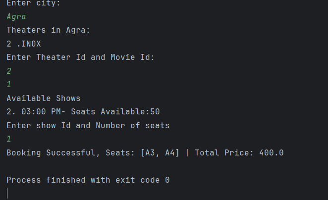
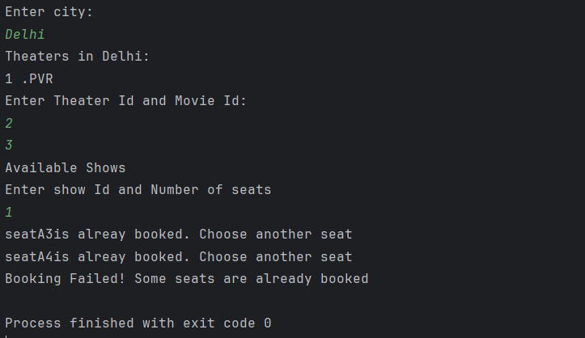

**BookMyShow backend using Core java and JDBC**

**Functional requirement:-**

* **Movies Views available in different cities**
* **Search movies by name**
* **Select theatre**
* **Select timing**
* **Card Booking**
* **Store all data**

**#Entity- class or table both (they hold data)**

* **user**
* **movie**
* **theatre (city)**
* **show**
* **seat**
* **booking**

